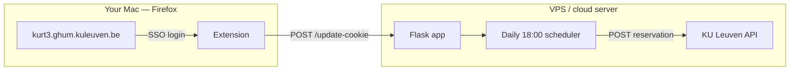

# KU Leuven Autobooker

Automatically books Agora study seats on [kurt3.ghum.kuleuven.be](https://kurt3.ghum.kuleuven.be) the moment slots open at **18:00** (8 days in advance).

The tricky part is authentication: KU Leuven uses Shibboleth SSO, which normally requires a browser login. This project splits the problem into two pieces:

1. **Firefox extension** — you stay logged in on kurt3; the extension captures your session cookie and sends it to the server.
2. **Booking server** — stores the cookie and fires the reservation API call at 18:00 with a small random delay.



---

## Project layout

| Path | What it does |
|------|--------------|
| `extension/` | Firefox add-on (Manifest V3). Reads `_shibsession` cookies from kurt3 and POSTs them to your server. |
| `server/app.py` | Flask webhook + scheduler. Stores cookies, books seats, handles check-in reminders. |
| `server/admin.html` | Web UI at `/admin` — view status, toggle booking on/off, set exam-period dates. |
| `server/.env.example` | Template for server secrets (`SECRET_KEY`, booking period, etc.). Copy to `.env` on deploy. |
| `server/Dockerfile` | Container image for production (gunicorn on port 8080). |
| `server/docker-compose.yml` | Run the server locally or on a VPS with Docker. |
| `server/deploy/setup-droplet.sh` | One-time setup script for a fresh Ubuntu DigitalOcean droplet. |
| `server/fly.toml`, `railway.toml`, `Procfile` | Alternative deploy targets (Fly.io, Railway). |
| `config/booking.local.json.example` | Example local config snapshot (generated by `scripts/sync-config.sh`). |
| `scripts/tunnel.sh` | SSH port-forward so the extension can reach the server **on KU campus WiFi** (ICTS blocks direct IPs). |
| `scripts/sync-config.sh` | Pulls current server settings into `config/booking.local.json`. |
| `scripts/tunnel-if-needed.sh` | Wrapper that starts the tunnel only when needed. |
| `scripts/install-tunnel-agent.sh` | Installs a macOS LaunchAgent for the tunnel (copies scripts to Application Support — required when the repo lives in `~/Documents`) |
| `scripts/setup-local.sh` | Copies example config files to gitignored local paths on first setup |

---

## How it works (day to day)

### 1. Keep your session fresh

Open [kurt3](https://kurt3.ghum.kuleuven.be) in **Firefox** (the extension only works there — not Chrome/Safari). Click the floating **"Send session to booker"** button, or click the extension icon.

The extension sends your Shibboleth cookie to `POST /update-cookie`. Do this whenever you log in again or the cookie expires.

### 2. Server books at 18:00

Every day at 18:00 (Belgian time — set `TZ=Europe/Brussels` on the server), the scheduler:

- Checks that booking is enabled and within your configured date window
- Verifies a valid cookie is stored
- Respects KU Leuven's weekly future-hour quota (48h/week for study seats)
- Waits a random 100–400 ms, then POSTs to the kurt3 reservations API
- Schedules an automatic check-in on the booking day (required within 30 min of start time)

### 3. Admin panel

Open `http://YOUR_SERVER:8080/admin` to see status, upcoming target date, and change settings without restarting the server.

---

## Server API

| Endpoint | Method | Purpose |
|----------|--------|---------|
| `/health` | GET | Status, cookie age, next booking target, quota usage |
| `/update-cookie` | POST | Extension sends session cookie (requires `secret`) |
| `/book-now` | POST | Manual test booking (requires `secret`) |
| `/config` | GET | Public read of booking settings |
| `/config` | POST | Update settings at runtime (requires `secret`) |
| `/admin` | GET | Settings web UI |

---

## Setup (for a new user)

Each person needs their **own** server (or shared server with their own KU login) and must edit the config with their student details.

### Server

```bash
cd server
python3 -m venv .venv && source .venv/bin/activate
pip install -r requirements.txt
cp .env.example .env          # set SECRET_KEY
# Edit app.py defaults OR use /admin after first run:
#   PARTICIPANT_UID, PARTICIPANT_EMAIL, RESOURCE_ID, times, etc.
python app.py                 # local dev on port 5000
```

For production, deploy with Docker (see `server/docker-compose.yml`) or use the droplet setup script.

### Firefox extension

```bash
./scripts/setup-local.sh
```

Then edit:

- `extension/relay-core.local.js` — `SECRET_KEY` (match server `.env`) and `WEBHOOK_URLS`
- `extension/manifest.json` — replace `YOUR_SERVER_IP` in `host_permissions`

Load the add-on:

1. Firefox → `about:debugging` → **This Firefox** → **Load Temporary Add-on**
2. Select `extension/manifest.json`
3. If Firefox asks for permissions → **Allow** (or enable in `about:addons` → your extension → **Permissions**)

Reload the add-on after any config change.

### KU campus WiFi + auto tunnel (recommended)

Campus WiFi blocks browser requests to external server IPs. The extension sends cookies via `localhost` through an SSH tunnel.

**Automatic (recommended):**

```bash
./scripts/install-tunnel-agent.sh
```

Runs at login + every 30 min during your active booking window. Re-run after editing `config/local.env`.

**Manual (when needed before the booking window starts):**

```bash
./scripts/tunnel.sh
```

Keep the terminal open while sending cookies. The **18:00 booking runs on the server** — your Mac and tunnel are not needed for that.

### Docker on the server

After changing `server/.env`, recreate the container (a plain `restart` does **not** reload env vars):

```bash
docker compose up -d --force-recreate
```

---

## Local secrets (what gets pushed vs what stays on your Mac)

**Yes — push placeholders, keep real values local.** Example files are committed; your actual config is gitignored.

| Committed (safe for GitHub) | Local only (gitignored) |
|-----------------------------|-------------------------|
| `config/local.env.example` | `config/local.env` |
| `extension/relay-core.local.js.example` | `extension/relay-core.local.js` |
| `extension/manifest.json.example` | `extension/manifest.json` |
| `extension/relay-core.js` (no secrets) | — |
| `server/.env.example` | `server/.env` (on droplet) |

**First-time setup on your Mac:**

```bash
./scripts/setup-local.sh
# then edit the three local files it creates
```

| File | What to put there |
|------|-------------------|
| `config/local.env` | Server IP, SSH key path, `SECRET_KEY` |
| `extension/relay-core.local.js` | Same `SECRET_KEY`, webhook URLs |
| `extension/manifest.json` | Replace `YOUR_SERVER_IP` in `host_permissions` |
| `server/.env` (on droplet) | Same `SECRET_KEY`, student ID, booking defaults |

All three `SECRET_KEY` values must match.

---

## Configuration reference

Key settings in `server/app.py` (or via `/admin` / `POST /config`):

| Setting | Meaning |
|---------|---------|
| `RESOURCE_ID` / `RESOURCE_NAME` | Which Agora seat to book |
| `PARTICIPANT_UID` / `PARTICIPANT_EMAIL` | Your KU student ID and email |
| `START_TIME` / `END_TIME` | Booking window (max 16h per booking) |
| `BOOKING_DATE_OFFSET_DAYS` | Days ahead slots open (8 for Agora) |
| `BOOKING_TIME` | Daily trigger time (`18:00:00`) |
| `BOOKING_PERIOD_START/END` | Only book during exam period |
| `BOOKING_ENABLED` | Master on/off switch |

Environment variables (see `server/.env.example`): `SECRET_KEY`, `PARTICIPANT_UID`, `PARTICIPANT_EMAIL`, `BOOKING_ENABLED`, `BOOKING_PERIOD_START`, `BOOKING_PERIOD_END`, `TZ`.

Extension secrets live in `extension/relay-core.local.js` (not in `relay-core.js`).

---

## Sharing this project with friends

**Yes — put it on GitHub.** That is the easiest way to share code, track changes, and let friends clone it.

### Recommended: private repository

1. Create a repo on [github.com/new](https://github.com/new) — choose **Private**
2. From this folder:

```bash
cd ku-leuven-autobooker
git init
git add .
git commit -m "Initial commit: KU Leuven study seat autobooker"
git branch -M main
git remote add origin https://github.com/YOUR_USERNAME/ku-leuven-autobooker.git
git push -u origin main
```

3. On GitHub: **Settings → Collaborators** → invite your friends

They clone it, run `./scripts/setup-local.sh`, and fill in their own local files and droplet `server/.env`.

### Before you push

`.gitignore` blocks local secret files. If you run `git status`, you should **not** see:

- `config/local.env`
- `extension/relay-core.local.js`
- `extension/manifest.json` (your copy with real server IP)
- `server/.env`
- `server/cookie_store.json`

### Public repo

Safe to make public once local secret files stay gitignored and `git status` shows no `local.env`, `relay-core.local.js`, or `manifest.json`. Rotate `SECRET_KEY` if an old key was ever committed.

---

## License

Personal/educational project. Use at your own risk — automated booking may conflict with KU Leuven terms of service. Check current campus booking rules before relying on this.
